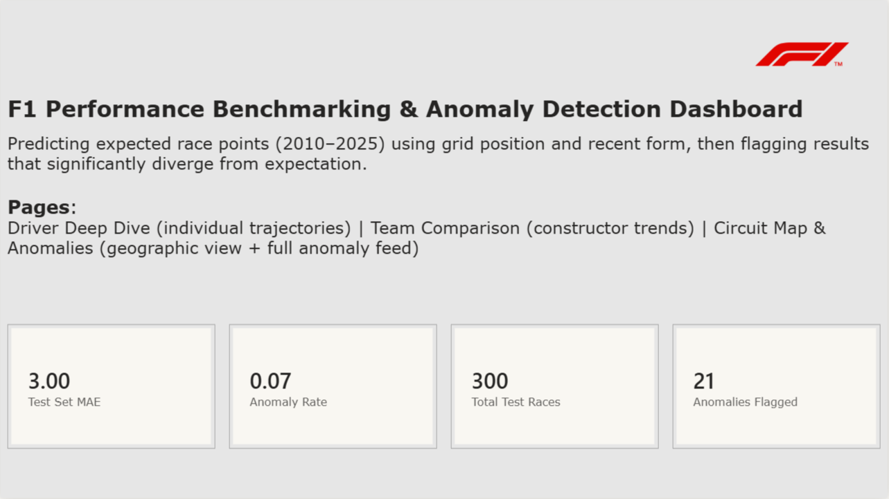
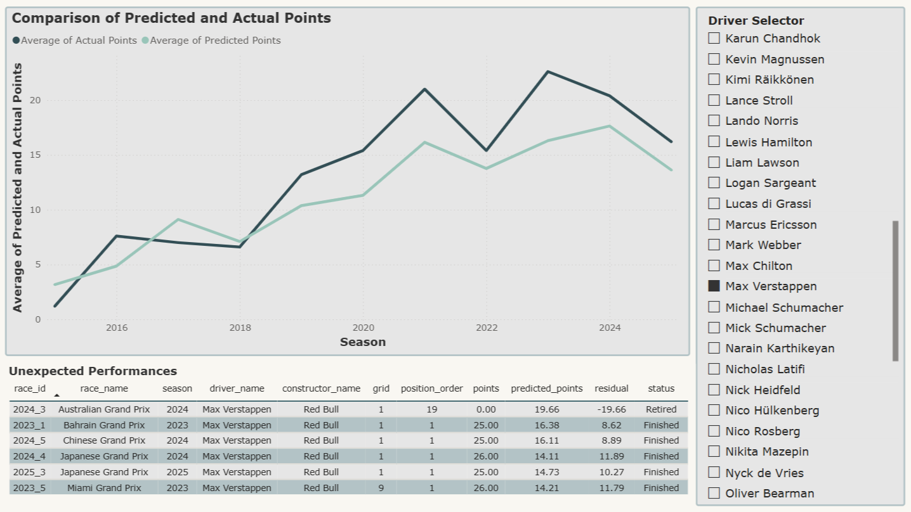
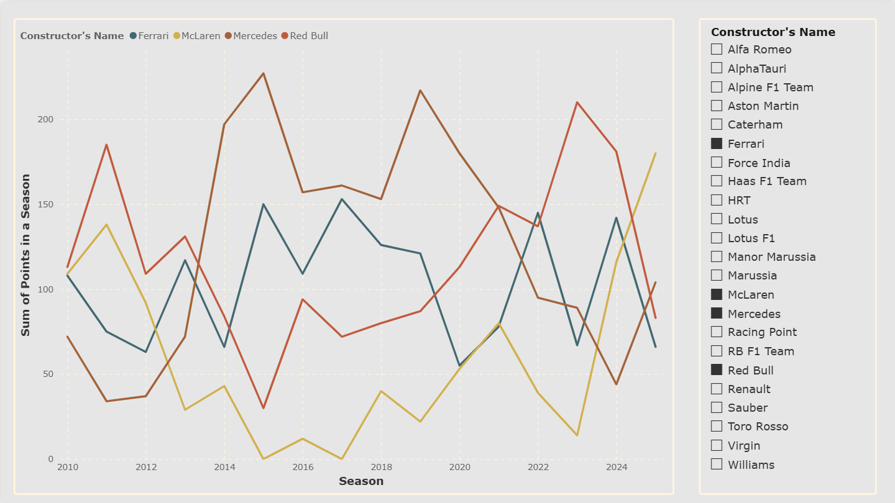
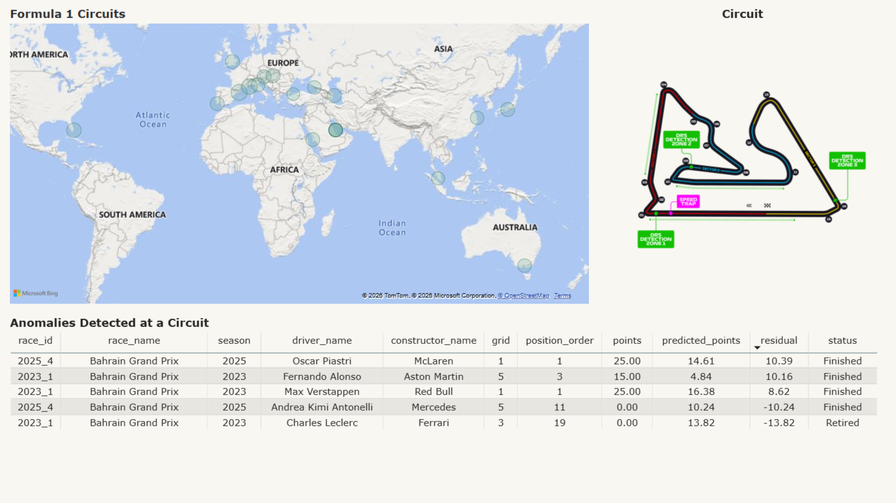

# F1 Performance Benchmarking & Anomaly Detection Dashboard

An end-to-end data analytics project that models expected Formula 1 race performance and flags results that significantly diverge from expectation — built using SQL Server, Python, and Power BI.



## Motivation

Race results in F1 are shaped by a mix of skill, strategy, and chance (mechanical failures, collisions, weather). This project asks: given a driver's grid position and recent form, how many points would we *expect* them to score — and which races diverged so far from that expectation that they're worth a closer look? The goal was to build a small but complete diagnostic tool, similar in spirit to the kind of performance/variance analysis used in operational benchmarking.

## Data

Source: [Formula 1 Championships (1950–2025)](https://www.kaggle.com/datasets/rockyt07/formula-1-championships-1950-2025) on Kaggle (Ergast-style relational tables: races, results, drivers, constructors, circuits, qualifying, driver/constructor standings).

The dataset is not included in this repo (see `.gitignore`) — download it from Kaggle and place the CSVs in a `Data/` folder to reproduce this project locally.

**Scope note:** the analysis is restricted to the 2010–2025 seasons. F1's points system changed multiple times before 2010 (e.g., 10-8-6-5-4-3-2-1 from 2003–2009, vs. the current 25-18-15-12-10-8-6-4-2-1 system), so mixing eras would have made `points` an inconsistent target variable for the model.

## Methodology

**1. SQL (SQL Server)**
Raw CSVs were loaded into SQL Server and joined into two views:
- `vw_RaceResults` — one row per driver per race, joined with driver, constructor, and circuit details.
- `vw_DriverStandingsHistory` — cumulative championship standings per driver per round (uses a `LEFT JOIN` to preserve ~300 standings rows tied to historical drivers missing from `drivers.csv`).

See [`sql/`](sql/) for the view definitions and the validation queries used to confirm no rows were silently dropped during joins.

**2. Feature engineering (Python / pandas)**
Two features were engineered to capture "current form" going into each race, both using `shift(1)` before any rolling calculation to ensure no race ever has access to its own outcome (or future races):
- `recent_form_points` — each driver's average points over their previous 3 races.
- `constructor_recent_form` — the same, computed per constructor.

**3. Model (scikit-learn)**
A linear regression predicts `points` from `grid`, `recent_form_points`, and `constructor_recent_form`. The data was split chronologically (train: 2010–2022, test: 2023–2025) rather than randomly, since a random split would let the model train on information from the future.

| Metric | Value |
|---|---|
| R² (test set) | 0.66 |
| MAE (test set) | 3.00 points |

**4. Anomaly detection**
For every race, `residual = actual points − predicted points`. Races in the test set where `|residual|` exceeds 2 standard deviations (≈ ±8.6 points) are flagged as anomalies — 21 out of 300 test races (7%). The threshold is calculated using only out-of-sample (test set) residuals, since in-sample residuals from the training data would understate genuine prediction error and produce an inconsistent threshold.

Negative anomalies (big underperformance) line up closely with `status = Retired` — i.e., the model correctly predicted a strong result that didn't happen because of a DNF. Positive anomalies (big overperformance) are mostly race wins that exceeded what recent form suggested, including a standout: Andrea Kimi Antonelli finishing P4 on his F1 debut from P16 on the grid.

**5. Dashboard (Power BI)**
A 4-page interactive report:
- **Overview** — methodology summary and live KPI cards (R²/MAE/anomaly rate, via DAX measures).
- **Driver Deep Dive** — actual vs. predicted points trend per driver, with a filtered anomaly table.
- **Team Comparison** — constructor championship trajectories, 2010–2025.
- **Circuit Map & Anomalies** — geographic view of circuits plus the full anomaly feed.





## Tools used
Python (pandas, scikit-learn), SQL Server / T-SQL, Power BI (DAX), Jupyter

## Project structure
```
├── sql/                 SQL view definitions + validation queries
├── notebooks/           Python notebook (feature engineering, model, anomaly detection)
├── powerbi/             Power BI .pbix dashboard file
├── screenshots/         Dashboard page exports
└── README.md
```

## Possible extensions
- Incorporate championship standings (`vw_DriverStandingsHistory`) as an additional "current form" feature.
- Add a classification model predicting podium finishes as a second angle on the same data.
- Extend feature set with qualifying gap-to-pole or circuit-archetype clustering.
